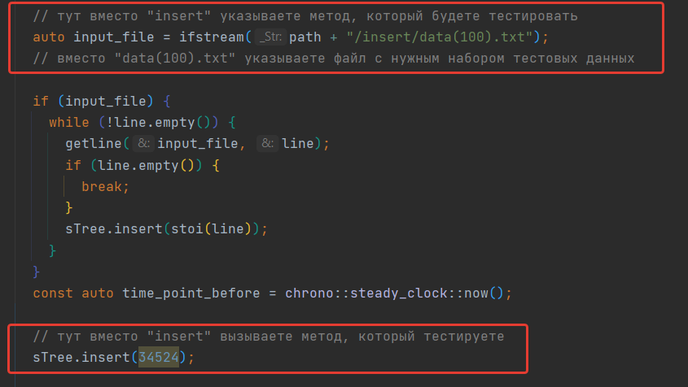
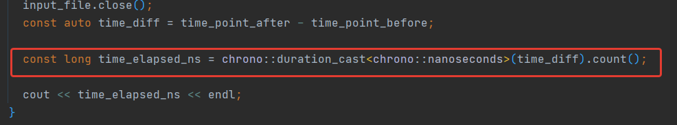
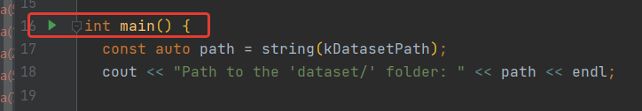

# Splay Trees

[](https://github.com/Algorithms-and-Data-Structures-2021/semester-work-template/actions/workflows/cmake.yml)


#### **_Краткое описание структуры данных Splay Tree_**
- Расширяющееся дерево (Splay Tree) - двоичное дерево поиска, в котором поддерживается свойство сбалансированности. Это дерево принадлежит классу «саморегулирующихся деревьев», которые поддерживают баланс ветвления дерева, чтобы обеспечить выполнение операций поиска, добавления и удаления. Это реализуется без использования дополнительных полей в узлах дерева.


- Splay-деревья используются в Windows NT (в виртуальной памяти, сети и коде файловой системы), компиляторе gcc и библиотеке GNU C++, редакторе строк sed, сетевых маршрутизаторах Fore Systems, наиболее популярной реализации Unix malloc, загружаемых модулях ядра Linux и во многих других программах.
   
    
**_Операции:_**
 - **_splay (расширение)_** - заключается в перемещении вершины в корень при помощи последовательного выполнения трех операций:
 - **_find (поиск)_** - поиск элемента в дереве и применение к найденному узлу операции splay
 - **_insert (вставка)_** - создание узла и его добавление в дерево
 - **_merge (сливать)_** - имеется два дерева, с помощью операции splay от самого большого элемента первого дерева, второе дерево делается правым поддеревоми, и возвращается полученное дерево
 - **_remove (удаление)_** - с помощью операции find нахождение удаляемого узла, обрезание двух дочерних поддерев и слитие получившихся деревьев с помощью метода merge
 - **_split (разделение)_** - поиск наименьшего элемента, большего или равного заданному элементу и применение к нему операции splay; после этого - отрезание у корня левого ребёнка и возвращение 2 получившихся дерева


~~~~
Сложность операций и требование по памяти:

  - Затраты по памяти - O(n)
  - Splay / Search / Split / Merge / Insert / Delete - O(log(n))
  ~~~~
  


 

## Команда "Team number seven"

_Заполните таблицу с указанием вклада каждого из участников в проект._


| Фамилия Имя   | Вклад (%) | Прозвище              |
| :---          |   ---:    |  ---:                 |
| Галеев Башир   |   33,3   |           -      |
| Рафикова Яна   |      33,3 |  - |     
| Терентьева Ольга   |    33,3    |     -     |


**Девиз команды**
> _Нет слова НЕ ХОЧУ, есть слово НАДО:)_

## Структура проекта

_Описание основных частей семестрового проекта._

**Пример**. Проект состоит из следующих частей:

- [`src`](src)/[`include`](include) - реализация структуры данных (исходный код и заголовочные файлы);
- [`benchmark`](benchmark) - контрольные тесты производительности структуры данных (операции добавления, удаления,
  поиска и пр.);
- [`examples`](examples) - примеры работы со структурой данных;
- [`dataset`](dataset) - наборы данных для запуска контрольных тестов и их генерация;

## Требования (Prerequisites)


1. С++ компилятор c поддержкой стандарта C++17 (например, _GNU GCC 8.1.x_ и выше).
2. Система автоматизации сборки _CMake_ (версия _3.12.x_ и выше).
3. Интерпретатор _Python_ (версия _3.7.x_ и выше).
4. Рекомендуемый объем оперативной памяти - не менее 6 ГБ.
5. Свободное дисковое пространство объемом ~ 3 ГБ (набор данных для контрольных тестов).

## Сборка и запуск


### Пример (Windows)

#### Сборка проекта


Склонируйте проект к себе на устройство через [Git for Windows](https://gitforwindows.org/) (либо используйте
возможности IDE):

```shell
https://github.com/Algorithms-and-Data-Structures-2021/semestr-work-splay-trees
```

Для ручной сборки проекта в терминале введите:

```shell
# переход в папку с проектом
cd C:\Users\username\asd-projects\semestr-work-splay-trees

# создание папки для файлов сборки (чтобы не засорять папку с проектом) 
mkdir -p build && cd build 

# сборка проекта
cmake .. -DCMAKE_BUILD_TYPE=RelWithDebInfo && cmake --config RelWithDebInfo --build . 
```

#### Генерация тестовых данных

Генерация тестового набора данных в
формате [comma-seperated values (TXT)](https://en.wikipedia.org/wiki/Comma-separated_values):

```shell
# переход в папку генерации набора данных
cd dataset

# запуск Python-скрипта
python generator.py
```

Тестовые данные представлены в TXT формате (см.
[`dataset/number/dataset-example.csv`](dataset/number/dataset-example.csv)):

```txt
1. 100
2. 500
3. 600

...
```

#### _Примечание_

По названию директории `/dataset/find` можно понять, что здесь хранятся наборы данных для контрольных тестов по
**добавлению** элементов в структуру данных. Названия файлов `100.txt`. `5000000.txt` и т.д. хранят информацию о размере набора данных (т.е. количество элементов). 

#### Контрольные тесты (benchmarks)


Для запуска контрольных тестов необходимо предварительно сгенерировать или скачать готовый набор тестовых данных. 

Ссылка на папку с набором тестовых данных: https://drive.google.com/drive/folders/1U5_3FNNo1fZuL1aQXHR7eLP3UllpwSf5


##### Список контрольных тестов

| Название                  | Описание                                | Метрики         |
| :---                      | ---                                     | :---            |
| `benchmark` | содержит в себе бенчмарки на все операции   | _время_         |


##### Примеры запуска

Для начала нужно изменить код в файле. Для этого открываем код в редакторе, например, в CLine и открываем класс demo_benchmark.cpp.
Затем ищем данный фрагмент кода:



Кроме того, можно изменить меру времени. Например, выводить время в милли-, а не наносекундах:



Запустить код можно здесь: 



В консоле будет выводиться время в наносекундах.


## Источники

_Список использованных при реализации структуры данных источников._

- Splay - дерево - Википедия:  https://ru.wikipedia.org/wiki/Splay-дерево

- Splay - дерево - Викиконспекты:  https://neerc.ifmo.ru/wiki/index.php?title=Splay-дерево

- Splay - деревья / Хабр:  https://habr.com/ru/company/JetBrains-education/blog/210296/

- Splay - деревья | SavePearlHarbor:  https://savepearlharbor.com/?p=210296

- YouTube канал: Pavel Mavrin “АиСД S02Eo7. Splay дерево”:  https://youtu.be/zvZEFqxmgOY


